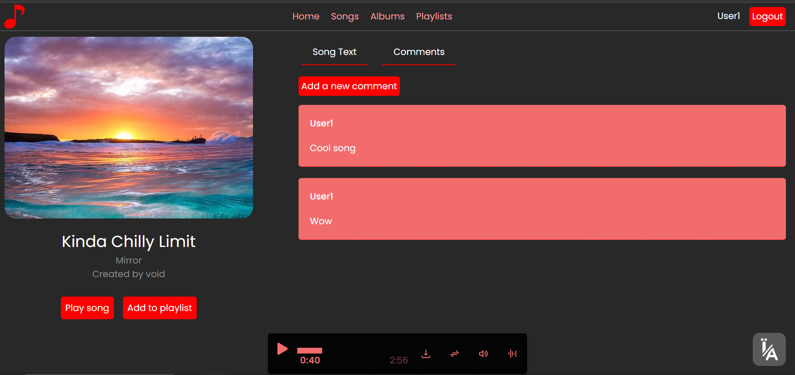
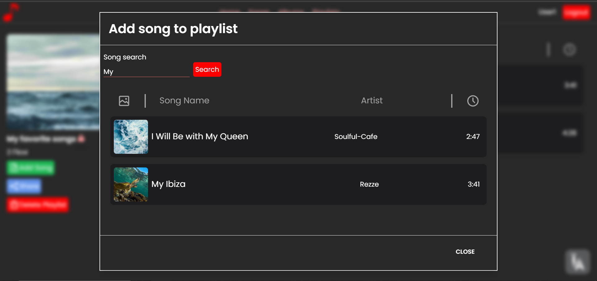
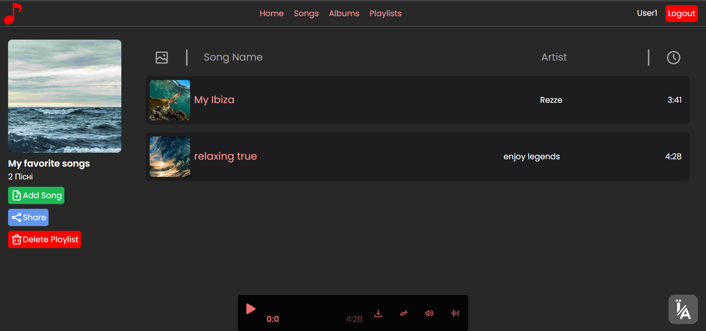
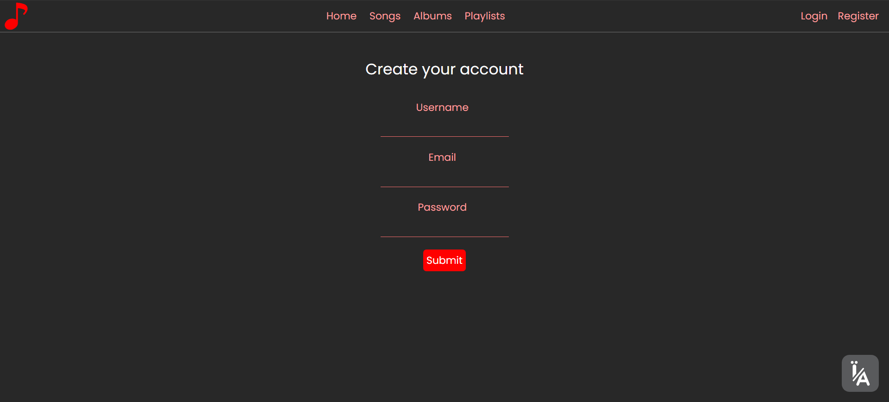
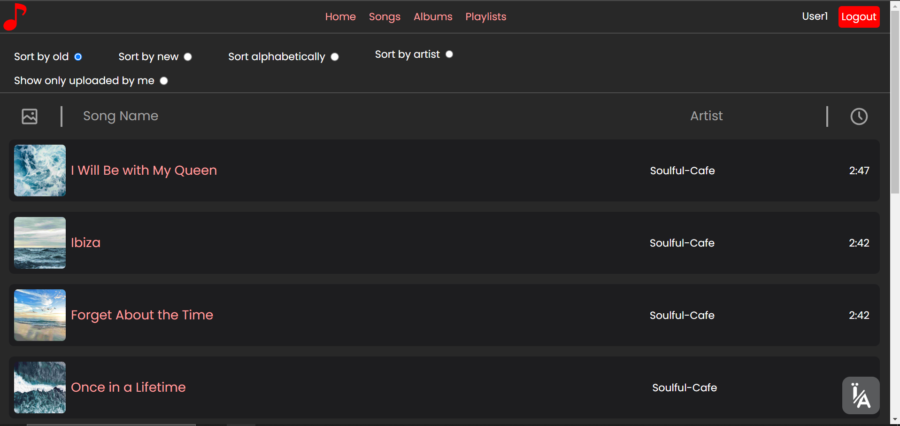
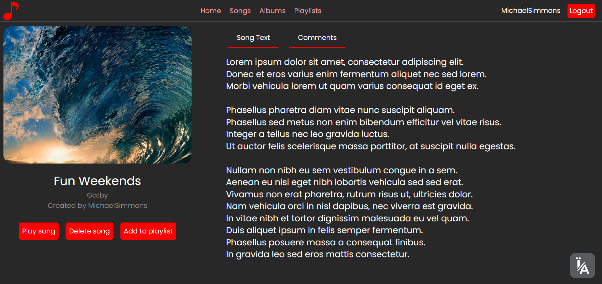

## Screenshots








## About
This is a music streaming app. It allows users to upload songs, create albums, and playlists.
Users can also comment on songs and listen to them. The application is built with Vue.js and Spring Boot.
The database is MongoDB. Static files are stored locally on the API server.

## Technologies used
### Client
- Vue.js 3
- Pinia
- Tailwind CSS
- Axios
- I18n
### Backend
- Java 17
- Spring Boot 3
- Spring Security + JWT
- Spring Data MongoDB
- Springdoc OpenAPI (Swagger UI)
- Gradle (Kotlin DSL)

## Set up with Docker
```bash
docker-compose up -d
```

## Web client Setup

Install packages:
```bash
yarn install
```

Run:
```bash
yarn serve
```

Navigate to `http://localhost:8080/`

## API Setup

Configure MongoDB URI and JWT secret in `backend/src/main/resources/application.yml`
or via environment variables:

```env
DB_URL=mongodb://127.0.0.1:27017/muz-dev
JWT_SECRET=your-secret-here
PORT=3000

# S3 file storage
S3_BUCKET=muz-media
S3_REGION=us-east-1
S3_ACCESS_KEY=your-access-key
S3_SECRET_KEY=your-secret-key
# S3_ENDPOINT=http://localhost:9000   # optional, for MinIO/LocalStack
```

Run:
```bash
cd backend
./gradlew bootRun
```

Swagger UI: `http://localhost:3000/doc`

Uploaded files (images and audio) are stored in S3 under `image/` and `audio/` key prefixes, and streamed back through the server at `GET /image/{name}` and `GET /audio/{name}`.

## API Routes

| ***Request type, path***    | ***Description***                            |
|-----------------------------|----------------------------------------------|
| **Authorization**           |                                              |
| POST /auth/login            | Login                                        |
| POST /auth/reg              | Register                                     |
| **Songs**                   |                                              |
| POST /songs                 | Upload a song (multipart)                    |
| GET /songs                  | Get all songs (pagination + filter)          |
| GET /songs/user             | Get songs added by a user                    |
| GET /songs/search           | Search songs by name or artist               |
| GET /songs/number           | Total song count                             |
| GET /songs/{id}             | Get song by ID (with comments)               |
| DELETE /songs/{id}          | Delete a song                                |
| POST /songs/comment         | Add a comment to a song                      |
| POST /songs/listen/{id}     | Increment listen counter                     |
| **Albums**                  |                                              |
| POST /album                 | Create an album (multipart)                  |
| GET /album                  | Get all albums (pagination)                  |
| GET /album/count            | Total album count                            |
| GET /album/search           | Search albums by name or author              |
| GET /album/{id}             | Get album by ID (with songs)                 |
| DELETE /album/{id}          | Delete album                                 |
| PUT /album/{id}/{songId}    | Add a song to an album                       |
| **Playlists**               |                                              |
| POST /playlists             | Create a playlist (multipart)                |
| GET /playlists              | Get current user's playlists                 |
| GET /playlists/{id}         | Get playlist by ID                           |
| PATCH /playlists/{id}       | Make playlist public                         |
| DELETE /playlists/{id}      | Delete playlist                              |
| GET /playlists/anon/{id}    | Get public playlist (no auth)                |
| PUT /playlists/{id}/{songId} | Add a song to a playlist                    |

## License

MIT licensed
