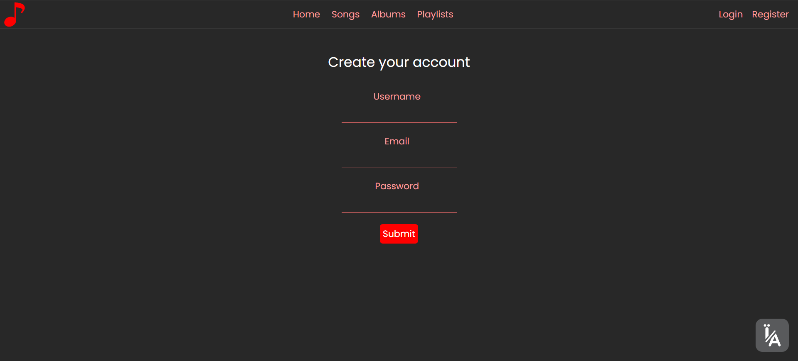

## Screenshots





## About
This is a music streaming app. It allows users to upload songs, create albums, and playlists. 
Users can also comment songs and listen to them. The application is built with Vue.js and Nest.js. 
The database  is MongoDB. Static files are stored locally on api server.

## Technologies used
### Client
- Vue.js 3
- Pinia
- Tailwind CSS
- Axios
- I18n
### Server
- Nest.js
- JWT & Passport
- Serve-static
- Swagger
- Mongoose
- MongoDB

## Set up with Docker
```bash
docker-compose up -d
```


## Web client Setup

Install packages:
```bash
yarn install
```

Run:
```bash
yarn serve
```

Navigate to `http://localhost:8080/`


## API Setup

Setup and configure mongo DB uri at `src/app.module.ts`

Install packages:
```bash
yarn install
```

Run:
```bash
yarn start:dev
```

Static files stored in `dist/static/`

Locally `http://localhost:3000/`

## API Routes

| ***Request type, path***   | ***Description of the request***             |
|----------------------------|----------------------------------------------|
| **Authorization**              |
| POST/auth/login            | Authorization                                |
| POST/auth/reg              | Registration                                 |
| **Songs**                  |
| POST/songs                 | Add a song                                   |
| GET/songs                  | Get all songs                                |
| GET/songs/user             | Get all songs, added by the certain user     |
| GET/songs/search           | Search for a song                            |
| GET/songs/number           | Number of all songs                          |
| GET/songs/{id}             | Get song by ID                               |
| DELETE/songs/{id}          | Delete a song                                |
| POST/songs/comment         | Add a comment to the song                    |
| POST/songs/listen/{id}     | Add listening to a song                                         |
| **Albums**                     |
| POST/album                 | Create an album                              |
| GET/album                  | Get all albums                               |
| GET/album/count            | Number of all albums                         |
| GET/album/search           | Search albums                                |
| GET/album/{id}             | Get album by ID                              |
| DELETE/album/{id}          | Delete album                                 |
| PUT/album/{id}/{songId}    | Add a song to an album                       |
| **Playlists**                  |
| POST/playlists             | Create a playlist                            |
| GET/playlists              | Get all playlists user                       |
| GET/playlists/{id}         | Get playlist by ID                           |
| PATCH/playlists/{id}       | Make a playlist public                       |
| DELETE/playlists/{id}      | Delete playlist                              |
| GET/playlists/anon/{id}    | Get public playlist from another user, by ID |                   
| PUT/playlists/{id}/{songId} | Add a song to playlist                       |


## License

MIT licensed